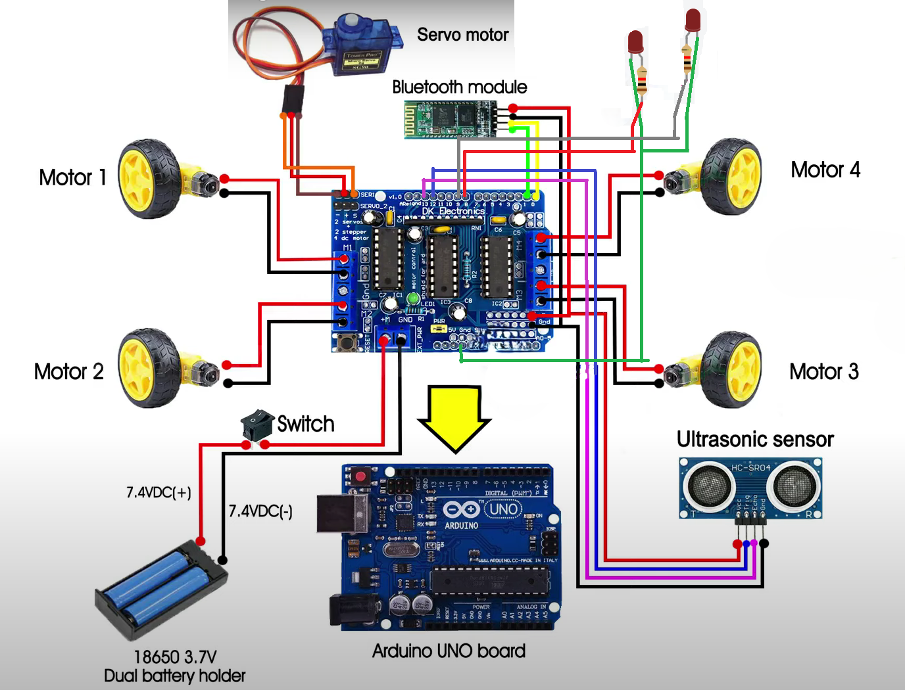

# Auto-Adjustable Headlights with Vehicle-to-Vehicle Detection

## Project Overview

This project aims to design and implement auto-adjustable headlight system that tilts the headlights downward when an object or another vehicle is detected to prevent glare. The system utilizes ultrasonic sensors and vehicle-to-vehicle detection to adjust the headlights, ensuring optimal visibility while enhancing road safety.

## Working Principle

1. **Detection**: Ultrasonic sensors and vehicle-to-vehicle detection sensors continuously scan for objects or vehicles.
2. **Measurement**: If an object or vehicle is detected within 10 cm, the sensor signals the microcontroller.
3. **Adjustment**: The microcontroller controls the motor, tilting the headlight downward.
4. **Reset**: The headlight returns to its original position when the object or vehicle moves away.

## Key Components

- **Ultrasonic Sensor**: Measures the distance of objects.
- **Vehicle-to-Vehicle Detection Sensor**: Detects other vehicles.
- **Microcontroller**: Processes sensor data and controls headlight position.
- **Servo/Stepper Motor**: Adjusts the headlight angle.
- **LED Headlights**: The light source being controlled.
- **Power Supply**: Provides power to the system.
- **Relay Module/MOSFETs**: Switches headlight brightness or activates tilt adjustments.

## Advantages

- **Improves Road Safety**: Prevents blinding pedestrians and drivers.
- **Fully Automatic**: No manual adjustment needed.
- **Energy Efficient**: Operates only when necessary.
- **Enhances Driving Comfort**: Automatic adjustments.
- **Useful in Low Visibility**: Maintains optimal visibility in foggy or rainy conditions.

## Applications

- **Passenger Cars**: Ensures safe urban and highway driving.
- **Trucks & Buses**: Prevents glare and improves visibility.
- **Motorcycles**: Adjusts headlight position dynamically.
- **Construction & Off-Road Vehicles**: Reduces glare in worksites.
- **Emergency Vehicles**: Enhances visibility without causing glare, improving response times.
- **Autonomous Vehicles**: Integrates with other systems to enhance safety and efficiency.

## Detailed Circuit Diagram

## Testing and Calibration

1. **Initial Setup**: Ensure all components are correctly connected.
2. **Distance Calibration**: Adjust the sensor range for accurate distance measurement.
3. **Servo Calibration**: Fine-tune the servo angles for optimal headlight positioning.
4. **Field Testing**: Conduct tests in real-world conditions to ensure system reliability.

## Future Enhancements

- **Advanced Sensors**: Use LiDAR for precise measurement.
- **Adaptive Brightness**: Adjust headlight brightness based on ambient light.
- **Integration**: Seamless integration with existing vehicle systems.
- **Smart Headlights**: Use machine learning to predict and adjust headlight angles based on driving patterns.
- **Wireless Communication**: Enable vehicle-to-vehicle communication for coordinated headlight adjustments.
- **Weather Adaptation**: Integrate weather sensors to adjust headlights for rain, fog, or snow conditions.
- **Voice Control**: Allow drivers to manually override and control the system using voice commands.
